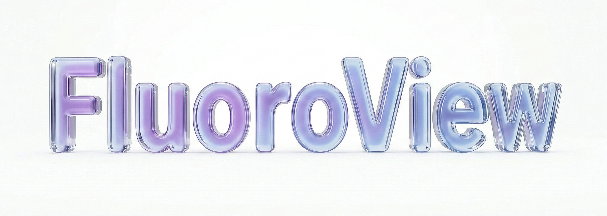
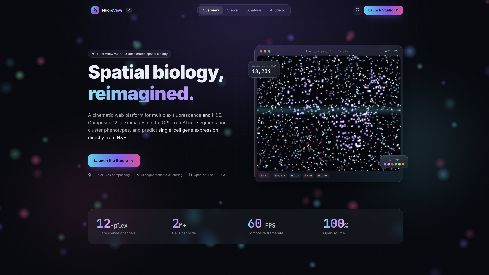
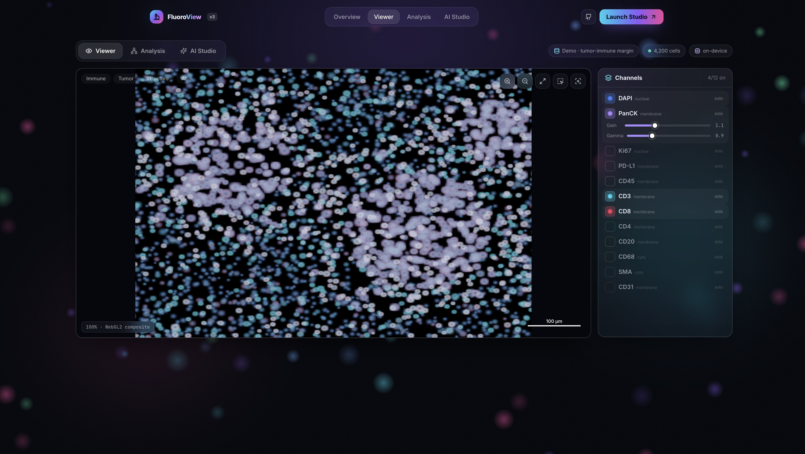
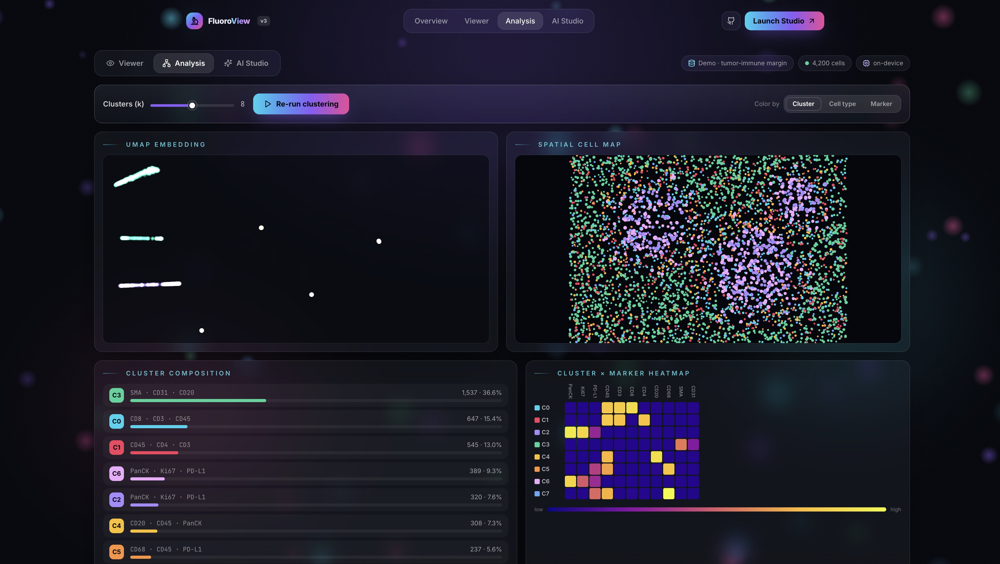
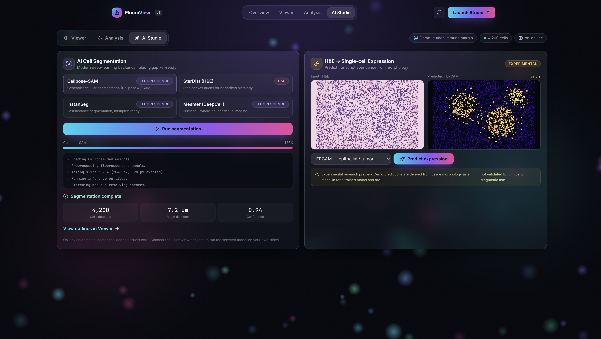

<p align="center">
  
</p>

<h1 align="center">FluoroView v3</h1>
<p align="center"><b>Spatial biology, reimagined.</b><br/>
A GPU-accelerated web platform for multiplex fluorescence &amp; H&amp;E — cinematic viewer, AI cell segmentation, phenotype clustering, and experimental H&amp;E&nbsp;→&nbsp;single-cell gene expression.</p>

<p align="center">
  
  
  
  
  
</p>

<p align="center">
  
</p>

---

## What's new in v3

FluoroView v2 is a mature Python **desktop** app for multiplex fluorescence microscopy. **v3 adds a brand-new, browser-based platform** that brings the whole spatial-biology workflow into a cinematic, GPU-accelerated web UI — while the v2 desktop app remains fully intact (see [below](#-v2--desktop-app-still-here)).

- **GPU multiplex compositing** — up to **12 fluorescence channels** blended in a WebGL2 shader with per-marker LUT color, gain and gamma; smooth 60&nbsp;FPS pan/zoom.
- **Modern AI segmentation** — Cellpose-SAM, StarDist and InstanSeg / Mesmer backends, tiled for gigapixel slides.
- **H&E cell segmentation** — bring brightfield histology into the same workspace.
- **Phenotyping & clustering** — standardize → PCA → **UMAP** embedding + **k-means / Leiden** clustering, cluster×marker heatmaps, and spatial cell maps.
- **H&E → single-cell gene expression** *(experimental)* — predict per-cell transcript abundance from morphology and paint spatial expression maps.
- **ROIs, annotations & export** — regions, notes, publication-ready composites and per-cell CSVs.

> The web app runs **entirely in your browser** on a built-in demo tissue — no upload, no signup, no setup. An optional [Python backend](server/README.md) adds model-backed segmentation & clustering on your own images.

---

## Gallery

<table>
  <tr>
    <td width="50%"><br/><sub><b>Viewer</b> — 12-plex WebGL2 composite with per-channel controls, ROI tools, and scale bar.</sub></td>
    <td width="50%"><br/><sub><b>Analysis</b> — UMAP embedding, spatial cell map, cluster composition, and marker heatmap.</sub></td>
  </tr>
  <tr>
    <td colspan="2"><br/><sub><b>AI Studio</b> — modern segmentation backends and the experimental H&amp;E&nbsp;→&nbsp;single-cell expression pipeline (clearly labeled, not for clinical use).</sub></td>
  </tr>
</table>

---

## Quick start — v3 web platform

```bash
git clone https://github.com/arvinhm/FluoroView.git
cd FluoroView/web

npm install
npm run dev          # open http://localhost:5273
```

Build a static bundle for hosting anywhere (GitHub Pages, S3, Netlify…):

```bash
npm run build        # outputs web/dist
npm run preview
```

### Optional: model-backed backend

```bash
cd server
python -m venv .venv && source .venv/bin/activate
pip install -r requirements.txt
uvicorn app:app --host 0.0.0.0 --port 8010
```

Once running, the Studio status chip flips to **backend online** and heavy work
(segmentation, clustering) can be offloaded to real models. See
[`server/README.md`](server/README.md) for the full API.

---

## Architecture

```
FluoroView/
├── web/                      # v3 web platform (React + TypeScript + Vite + WebGL2)
│   ├── src/lib/              # synth tissue, WebGL compositor, PCA/KMeans/UMAP, API client
│   └── src/components/       # landing (GSAP hero) + Studio (Viewer / Analysis / AI Studio)
├── server/                   # v3 optional FastAPI backend (segmentation, clustering, H&E→expr)
├── fluoroview/               # v2 desktop app (Python / CustomTkinter) — unchanged
├── docs/screenshots/         # README imagery
└── paper.md, CITATION.cff    # JOSS paper & citation metadata
```

The web client is **self-contained**: it generates a realistic 12-plex tumor–immune
demo tissue and drives the viewer, analysis and AI views from that single dataset,
so every feature is interactive out of the box.

---

## ⚠️ H&E → gene-expression: experimental notice

The H&amp;E → single-cell expression feature is a **research preview**. In demo mode
(and in the backend without trained weights) predictions are a transparent,
morphology-derived estimate used to demonstrate the workflow — they are **not a
validated model output and must not be used for clinical or diagnostic purposes.**

---

## 🖥️ v2 — desktop app (still here)

The original cross-platform desktop application is unchanged and fully supported.

```bash
pip install -r fluoroview/requirements.txt
python run_fluoroview.py
```

FluoroView v2 comprises 42 Python modules across six subpackages — **core/** (tile
engine, ROIs, annotations), **ui/** (CustomTkinter), **analysis/** (per-cell
quantification & phenotyping), **segmentation/** (Cellpose, DeepCell, mask import),
**io/** (multi-format loading, sessions, export), and **ai/** (multi-provider chat).
It supports TIFF/OME-TIFF/SVS/CZI, 50-channel windowing, Cellpose/DeepCell
segmentation, four-panel single-cell analysis, threshold-based phenotyping, and
`.fluoroview.npz` session persistence.

---

## Citation

```bibtex
@article{hajmirzaian2026fluoroview,
  title   = {FluoroView: An Open-Source Application for Interactive Multiplex
             Fluorescence Microscopy Visualization, Annotation, and Single-Cell Phenotyping},
  author  = {Haj-Mirzaian, Arvin and Heidari, Pedram},
  journal = {Journal of Open Source Software},
  year    = {2026}
}
```

## License

BSD 3-Clause. See [LICENSE](LICENSE).

## Credits

Building upon and inspired by [Cellpose](https://github.com/MouseLand/cellpose),
[StarDist](https://github.com/stardist/stardist),
[DeepCell](https://github.com/vanvalenlab/deepcell-tf),
[MCMICRO](https://github.com/labsyspharm/mcmicro),
[Minerva](https://github.com/labsyspharm/minerva-story),
[SCIMAP](https://github.com/labsyspharm/scimap),
[QuPath](https://qupath.github.io/), and [napari](https://napari.org).

<p align="center"><sub>FluoroView v3 · Haj-Mirzaian &amp; Heidari · BSD-3</sub></p>
