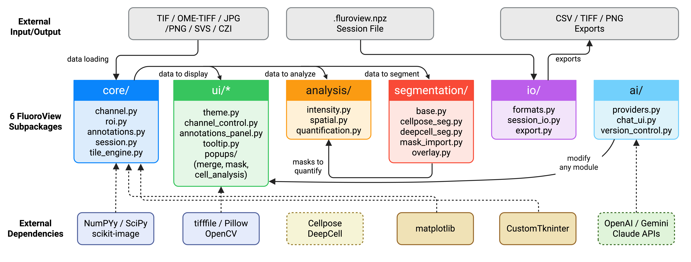

# Summary

Advances in highly multiplexed tissue imaging enable simultaneous detection of
10--100 proteins at subcellular resolution [@bodenmiller2016multiplexed].
Technologies such as cyclic immunofluorescence (CyCIF), CODEX, MIBI, and Imaging
Mass Cytometry generate datasets that routinely exceed tens of gigabytes per
whole-slide image [@lin2018highly], posing substantial challenges for interactive
visualization and quantitative analysis. FluoroView is a free, open-source Python
desktop application that provides a unified environment for multiplex
fluorescence image analysis on macOS, Windows, and Linux. It combines a
high-performance tile-cached viewer with LUT-based compositing for up to 50
channels, interactive ROI tools with automated quantification, author-tracked
annotations, Cellpose-powered cell segmentation [@cellpose; @cellpose3],
vectorized per-cell expression quantification, threshold-based cell phenotyping
with combinatorial marker annotation, and an integrated AI assistant supporting
OpenAI, Google Gemini, and Anthropic Claude. FluoroView is distributed under the
BSD 3-Clause license at <https://github.com/arvinhm/FluoroView>.

# Statement of need

Multiplexed tissue imaging has become a cornerstone of spatial biology, yet
analysis remains a significant bottleneck. The typical workflow requires
researchers to switch between multiple tools: one for viewing, another for
annotation, a separate pipeline for segmentation, and yet another for
quantitative analysis and cell phenotyping. This fragmentation wastes time,
introduces errors, and makes results difficult to reproduce. FluoroView is
designed for biomedical researchers---pathologists, immunologists, and spatial
biologists---who need to view, annotate, segment, quantify, and phenotype
multiplex fluorescence images in a single application without programming,
server infrastructure, or commercial licenses.

# State of the field

Existing open-source tools address subsets of the multiplex imaging workflow.
QuPath [@bankhead2017qupath] excels at pathology annotation but lacks integrated
deep-learning segmentation with live overlay and built-in threshold-based cell
phenotyping. Napari [@napari] provides powerful n-dimensional visualization but
requires Python scripting for analytical workflows. MCMICRO [@mcmicro] offers a
comprehensive command-line pipeline but requires Nextflow and Docker. Minerva
Story [@minerva_story] enables web-based narrative visualization but cannot
perform segmentation or quantitative analysis. Scope2Screen [@scope2screen]
provides spatial queries but requires server deployment. DeepCell [@deepcell] and
UnMicst [@unmicst] provide segmentation but lack integrated viewers. ImageJ/FIJI
[@schindelin2012fiji] lacks native multi-channel compositing with per-channel
gamma correction and integrated deep-learning segmentation. SCIMAP [@scimap]
offers downstream spatial analysis in Python but has no graphical viewer.
Commercial platforms (HALO, Visiopharm, inForm) offer polished interfaces but
impose license fees of \$10,000--\$50,000 per seat and prevent reproducible
sharing of workflows.

We chose to build FluoroView as a standalone application rather than contribute
to existing projects because no single tool integrates all six workflow stages
(viewing, annotation, segmentation, quantification, phenotyping, export) in a
zero-infrastructure desktop application. FluoroView deliberately builds upon
established libraries---tifffile [@tifffile] for image I/O, Cellpose for
segmentation, scipy.ndimage [@scipy] for quantification, scikit-image
[@scikit-image] for boundary detection---rather than reimplementing solved
problems, focusing its unique contribution on the integration layer, the
tile-cached rendering engine, and the phenotyping workflow.

# Software design

FluoroView comprises 42 Python modules (~8,400 lines) in six subpackages
(\autoref{fig:architecture}): **core/** (memory-mapped channel arrays, ROIs,
annotations with machine-fingerprint identity tracking, session serialization,
tile-based rendering engine); **ui/** (CustomTkinter [@customtkinter] interface
with per-channel controls, annotation panel, analysis and phenotyping dialogs);
**analysis/** (vectorized per-cell quantification via scipy.ndimage, BallTree
spatial queries via scikit-learn [@scikit-learn], threshold-based phenotyping);
**segmentation/** (pluggable Cellpose and DeepCell Mesmer backends, TIFF mask
import, boundary overlay via scikit-image); **io/** (multi-format loading
supporting TIFF, OME-TIFF, JPEG, PNG, SVS, CZI; multi-file channel merging;
session files; CSV and image export); and **ai/** (multi-provider chat with
OpenAI/Gemini/Claude, snapshot-based version control, module hot-reloading).

A key design trade-off was choosing precomputed uint16$\rightarrow$uint8 lookup
tables for contrast/gamma over per-pixel floating-point math. This sacrifices
sub-integer precision but achieves 14.6 ms per frame (69 FPS) for 4-channel
compositing with OpenCV-accelerated resize [@opencv] and a 256-tile LRU cache
(\autoref{fig:viewer}). For cell quantification, we chose vectorized
scipy.ndimage operations (single-pass mean/sum/median over all cells) over the
conventional per-cell regionprops approach, reducing quantification of 13,000
cells from minutes to seconds.

FluoroView provides three ROI types with publication-quality export
(\autoref{fig:rois}), Cellpose segmentation with five model presets and tiled
parallel processing (\autoref{fig:segmentation}), simultaneous four-panel
single-cell analysis with actual cell mask rendering (\autoref{fig:analysis}),
and threshold-based cell phenotyping with combinatorial marker annotation (e.g.,
Membrane^+^ ECM^-^ PanC^+^ NM^-^) and spatial visualization
(\autoref{fig:analysis}).

# Research impact statement

FluoroView was developed to support ongoing multiplex immunofluorescence research
at Massachusetts General Hospital and Harvard Medical School, where it is
actively used for CyCIF tissue analysis in the Division of Nuclear Medicine and
Molecular Imaging. The software has been benchmarked on whole-slide images
containing over 33,000 segmented cells across 5 channels, demonstrating
real-time interactive performance (69 FPS) and complete phenotyping workflows
with 15+ distinct cell populations. FluoroView's session persistence format
(`.fluoroview.npz`) enables reproducible sharing of complete analysis states
between collaborators. The combination of zero-infrastructure installation, no
license fees, and an integrated AI assistant for customization positions
FluoroView as accessible community infrastructure for spatial biology
laboratories that cannot afford commercial platforms.

# Acknowledgements

This work was supported by the Division of Nuclear Medicine and Molecular
Imaging, Department of Radiology, Massachusetts General Hospital. The authors
acknowledge the developers of Cellpose, MCMICRO, Minerva Story, Scope2Screen,
DeepCell, UnMicst, and SCIMAP for their open-source contributions.

# AI usage disclosure

Generative AI tools (Anthropic Claude 4.6 Opus, via the Cursor IDE) were used
during development for code debugging and performance optimization.
All AI-generated outputs were reviewed, validated, and approved by the human authors. 

